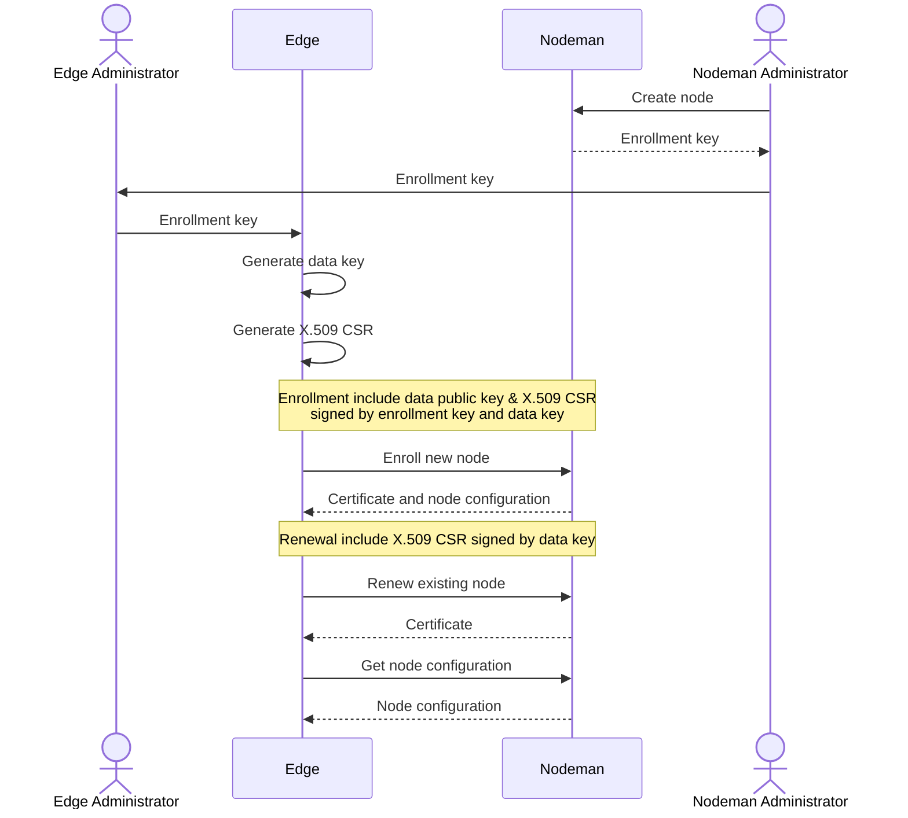

# DNS TAPIR Node Manager

This repository contains the DNS TAPIR Node Manager, a server component for managing nodes.




## Bootstrap Information


```json
{
    "name": "clever-albattani.dev.dnstapir.se",
    "key": {
        "kty": "OKP",
        "kid": "678e4054dc01bfd30ed2c22a",
        "alg": "EdDSA",
        "crv": "Ed25519",
        "x": "bS8fqjtAhGfPZFRD0huGqejA46lZTPvhk5QunGYWPbc",
        "d": "O1eqmHabqYSrnh7FyZTzzpYJRsvYFSofTssW_yA5nnk"
    },
    "nodeman_url": "http://localhost:8080/"
}
```

## Enrollment

### Request

The enrollment request is a JWS signed with both the data and enrollment keys (algorithms depending on key algorithm). JWS payload is a dictionary with the following properties:

- `timestamp`, A timestamp with the current time (ISO8601)
- `x509_csr`, A string with a PEM-encoded X.509 Certificate Signing Request with _Common Name_ and _Subject Alternative Name_ set to the full node name.
- `public_key`, A JWK dictionary containing the public data key.

#### Example

```json
{
    "payload": "eyJ0aW1lc3RhbXAiOiAiMjAyNS0wMS0xM1QxMTo0Nzo0OC4xNjE2ODMrMDA6MDAiLCAieDUwOV9jc3IiOiAiLS0tLS1CRUdJTiBDRVJUSUZJQ0FURSBSRVFVRVNULS0tLS1cbk1JSHBNSUdjQWdFQU1Dc3hLVEFuQmdOVkJBTU1JR05zWlhabGNpMWhiR0poZEhSaGJta3VaR1YyTG1SdWMzUmhcbmNHbHlMbk5sTUNvd0JRWURLMlZ3QXlFQUlyV0M3cmd5VW5Vc1Z1U1YvczhDUkFLQ1BOeklqVzJwd3dYbHpvMm1cbkgzMmdQakE4QmdrcWhraUc5dzBCQ1E0eEx6QXRNQ3NHQTFVZEVRUWtNQ0tDSUdOc1pYWmxjaTFoYkdKaGRIUmhcbmJta3VaR1YyTG1SdWMzUmhjR2x5TG5ObE1BVUdBeXRsY0FOQkFNSWVmTklteHdKV1A3dkh1OGFjaWN0VGo0ZFhcbkRPallTT3U0SmxHZ1BWY2FadXpJQWUwekJZYTBWclZzQWJKTjBabGJpN2l4Q3pWMWNJL0Vndktob2dZPVxuLS0tLS1FTkQgQ0VSVElGSUNBVEUgUkVRVUVTVC0tLS0tXG4iLCAicHVibGljX2tleSI6IHsia3R5IjogIk9LUCIsICJraWQiOiAiY2xldmVyLWFsYmF0dGFuaS5kZXYuZG5zdGFwaXIuc2UiLCAiY3J2IjogIkVkMjU1MTkiLCAieCI6ICJLd0RYLUZGVWk3anZGeUlMam1ILWJUWS1QdEQzYTl0cXpacThkaGdDdHA0In19",
    "signatures": [
        {"protected": "eyJhbGciOiJIUzI1NiJ9", "signature": "xoaCPDxHU200bwH7X7fFNkK1CrSJfWmhES45BgDEi8s"},
        {"protected": "eyJhbGciOiJFZERTQSJ9", "signature": "BRVdXDezpra0XOoigd_CjeJwsorABUyDrtM6FbPxR7EJGj4KoZSlEVio7z3R2cY60JEK3YtKHHmf3-Rb8C7jCQ"}
    ]
}
```


### Response

The enrollment response is a dictionary containing at least the following properties:

- `x509_certificate`, X.509 Client Certificate Bundle (PEM)
- `x509_ca_certificate`, X.509 CA Certificate Bundle (PEM)
- `mqtt_broker`, MQTT broker address (URI)
- `mqtt_topics`, Dictionary of per application MQTT configuration topic
- `trusted_jwks`, JWKSet with keys used for signing data from core services

#### Example

```json
{
    "x509_certificate": "-----BEGIN CERTIFICATE-----\nMIIBvjCCAWSgAwIBAgIUDYL+dGXZi0r55Bcx6W10OB2zBWgwCgYIKoZIzj0EAwIw\nEjEQMA4GA1UEAxMHcm9vdC1jYTAeFw0yNTAxMTMxMTM3NDhaFw0yNTAxMTQxMTQ3\nNDhaMCsxKTAnBgNVBAMMIGNsZXZlci1hbGJhdHRhbmkuZGV2LmRuc3RhcGlyLnNl\nMCowBQYDK2VwAyEAIrWC7rgyUnUsVuSV/s8CRAKCPNzIjW2pwwXlzo2mH32jga0w\ngaowDgYDVR0PAQH/BAQDAgWgMB0GA1UdJQQWMBQGCCsGAQUFBwMCBggrBgEFBQcD\nATAdBgNVHQ4EFgQU1qfnmLr4PzuNjOKQpRtP/AVG0TEwHwYDVR0jBBgwFoAUKEKd\n+9C4+ToR7v+0Df32m13PSgEwKwYDVR0RBCQwIoIgY2xldmVyLWFsYmF0dGFuaS5k\nZXYuZG5zdGFwaXIuc2UwDAYDVR0TAQH/BAIwADAKBggqhkjOPQQDAgNIADBFAiAJ\ni+n9z1Fz8+UR0xQPeOcsOBG0mDq5q1LDI0fCDYetLwIhANpUGtYtEV/uf3TuZc5n\njUg6b2D71HYFOv75VgKSw39C\n-----END CERTIFICATE-----\n",
    "x509_ca_certificate": "-----BEGIN CERTIFICATE-----\nMIIBZjCCAQ2gAwIBAgIQRFZ6q3hXKX55Igrkgua43zAKBggqhkjOPQQDAjASMRAw\nDgYDVQQDEwdyb290LWNhMB4XDTI0MTIxODA4NDA1M1oXDTM0MTIxNjA4NDA1M1ow\nEjEQMA4GA1UEAxMHcm9vdC1jYTBZMBMGByqGSM49AgEGCCqGSM49AwEHA0IABJJh\npPJphwesqqw2Xwmmt70rpPaR3vgAW5K9gyE6NkMDbyXTVJDn/H/nk91mukEYBnhg\nbEX4djrvgvC8yxRf67WjRTBDMA4GA1UdDwEB/wQEAwIBBjASBgNVHRMBAf8ECDAG\nAQH/AgEBMB0GA1UdDgQWBBQoQp370Lj5OhHu/7QN/fabXc9KATAKBggqhkjOPQQD\nAgNHADBEAiB9mRBHMK/LgV2wV1DLCCjkHefLMTzmV25VdlFbTzL4UQIgSmtah/EQ\nALEtqOmoDNK53eIyYXLVvUFcavq3tT4SWXE=\n-----END CERTIFICATE-----\n",
    "x509_certificate_not_valid_after": "2025-01-14T11:47:48Z",
    "name": "clever-albattani.dev.dnstapir.se",
    "mqtt_broker": "mqtts://localhost:1883",
    "mqtt_topics": {
        "tem": "configuration/tem",
        "pop": "configuration/pop"
    },
    "trusted_jwks": {
        "keys": [
            {
                "kty": "OKP",
                "kid": "key1",
                "crv": "Ed25519",
                "x": "da6-VSYfELgDOgbRo4SBZbwMF33nDZx843rd7HoMHeQ"
            },
            {
                "kty": "EC",
                "kid": "key2",
                "crv": "P-256",
                "x": "ZfFPJCRl15KXqeunjb-CTVqYLYaY1Xun6WrSHQbRYws",
                "y": "bxf0CaW2ZScHZ0MG8VRftM3su8LfBzCygnKNi6Z7_TQ"
            }
        ]
    }
}
```


## Renewal

### Request

The renewal request is a JWS signed with the data key (algorithm depending on key algorithm). JWS payload is a dictionary with the following properties:

- `timestamp`, A timestamp with the current time (ISO8601)
- `x509_csr`, A string with a PEM-encoded X.509 Certificate Signing Request with _Common Name_ and _Subject Alternative Name_ set to the full node name.

#### Example

```json
{
    "payload": "eyJ0aW1lc3RhbXAiOiAiMjAyNS0wMS0xM1QxMTo0Nzo0OC44ODUyNzQrMDA6MDAiLCAieDUwOV9jc3IiOiAiLS0tLS1CRUdJTiBDRVJUSUZJQ0FURSBSRVFVRVNULS0tLS1cbk1JSHBNSUdjQWdFQU1Dc3hLVEFuQmdOVkJBTU1JR05zWlhabGNpMWhiR0poZEhSaGJta3VaR1YyTG1SdWMzUmhcbmNHbHlMbk5sTUNvd0JRWURLMlZ3QXlFQVorMVgyK1U2MjVFM2Q1NnQvMC9hS0g4MnZjdDdJVmthQkFFd2ZmNWxcbmtwMmdQakE4QmdrcWhraUc5dzBCQ1E0eEx6QXRNQ3NHQTFVZEVRUWtNQ0tDSUdOc1pYWmxjaTFoYkdKaGRIUmhcbmJta3VaR1YyTG1SdWMzUmhjR2x5TG5ObE1BVUdBeXRsY0FOQkFCK3E4NWFwZFRHQy9Lbkh3WFRPQVR4eTNZdGZcbjZyQU9MWlhpbHI4Sy8wK1pUSHQ3OFRua2QvdTFhS24ybmY2WkZFbFBFOTV2ZWlnY2M3RkQ0Slc0QWdvPVxuLS0tLS1FTkQgQ0VSVElGSUNBVEUgUkVRVUVTVC0tLS0tXG4ifQ",
    "protected": "eyJhbGciOiJFZERTQSJ9",
    "signature": "Nkv4Tg2u-iTxKulDh9tfo4S1P5OySCuvCbSo84y3WjqR2UqxfoFNFMrnPAnP8u_mke8uvqJqD8oQ_KFEtcy4Dg"
}
```

### Response

The enrollment response is a dictionary containing at least the following properties:

- `x509_certificate`, X.509 Client Certificate Bundle (PEM)
- `x509_ca_certificate`, X.509 CA Certificate Bundle (PEM)

#### Example

```json
{
    "x509_certificate": "-----BEGIN CERTIFICATE-----\nMIIBvjCCAWSgAwIBAgIUWSQJA6SqsynRYBP/uZYaQOpq1RkwCgYIKoZIzj0EAwIw\nEjEQMA4GA1UEAxMHcm9vdC1jYTAeFw0yNTAxMTMxMTM3NDhaFw0yNTAxMTQxMTQ3\nNDhaMCsxKTAnBgNVBAMMIGNsZXZlci1hbGJhdHRhbmkuZGV2LmRuc3RhcGlyLnNl\nMCowBQYDK2VwAyEAZ+1X2+U625E3d56t/0/aKH82vct7IVkaBAEwff5lkp2jga0w\ngaowDgYDVR0PAQH/BAQDAgWgMB0GA1UdJQQWMBQGCCsGAQUFBwMCBggrBgEFBQcD\nATAdBgNVHQ4EFgQUrpm/xsMWfgR11AFpdWmyxZRvZQcwHwYDVR0jBBgwFoAUKEKd\n+9C4+ToR7v+0Df32m13PSgEwKwYDVR0RBCQwIoIgY2xldmVyLWFsYmF0dGFuaS5k\nZXYuZG5zdGFwaXIuc2UwDAYDVR0TAQH/BAIwADAKBggqhkjOPQQDAgNIADBFAiEA\n4cYa2Yb2nt8zdtg8HEuwPxByuZGslup8ODfVFRdHVwcCIAuQkLfzSEiz1EXIieYq\nbwrcuWy8JdrvBEFv7TMR8O/R\n-----END CERTIFICATE-----\n",
    "x509_ca_certificate": "-----BEGIN CERTIFICATE-----\nMIIBZjCCAQ2gAwIBAgIQRFZ6q3hXKX55Igrkgua43zAKBggqhkjOPQQDAjASMRAw\nDgYDVQQDEwdyb290LWNhMB4XDTI0MTIxODA4NDA1M1oXDTM0MTIxNjA4NDA1M1ow\nEjEQMA4GA1UEAxMHcm9vdC1jYTBZMBMGByqGSM49AgEGCCqGSM49AwEHA0IABJJh\npPJphwesqqw2Xwmmt70rpPaR3vgAW5K9gyE6NkMDbyXTVJDn/H/nk91mukEYBnhg\nbEX4djrvgvC8yxRf67WjRTBDMA4GA1UdDwEB/wQEAwIBBjASBgNVHRMBAf8ECDAG\nAQH/AgEBMB0GA1UdDgQWBBQoQp370Lj5OhHu/7QN/fabXc9KATAKBggqhkjOPQQD\nAgNHADBEAiB9mRBHMK/LgV2wV1DLCCjkHefLMTzmV25VdlFbTzL4UQIgSmtah/EQ\nALEtqOmoDNK53eIyYXLVvUFcavq3tT4SWXE=\n-----END CERTIFICATE-----\n",
    "x509_certificate_not_valid_after": "2025-01-14T11:47:48Z"
}
```


## Configuration File

```toml
[mongodb]
server =  "mongodb://localhost/nodeman"

[internal_ca]
issuer_ca_certificate = "internal_ca_certificate.pem"
issuer_ca_private_key = "internal_ca_private_key.pem"
validity_days = 60

[nodes]
nodeman_url = "https://nodeman.example.com"
domain = "example.com"
trusted_jwks = "trusted_jwks.json"
mqtt_broker = "mqtts://localhost"

[nodes.mqtt_topics]
tem = "configuration/tem"
pop = "configuration/pop"

[enrollment]
kty = "OKP"
crv = "Ed25519"
alg = "EdDSA"

[otlp]
spans_endpoint = "http://localhost:4317"
metrics_endpoint = "http://localhost:4317"
insecure = true

[[users]]
username = "username"
password_hash = "$argon2id$v=19$m=65536,t=3,p=4$2UbbvL5YpSjGyeha++HE5g$o8iGuvAgrl0azPFDK79mCYQT10nqIGyU1XLipGwL4rc"
```
